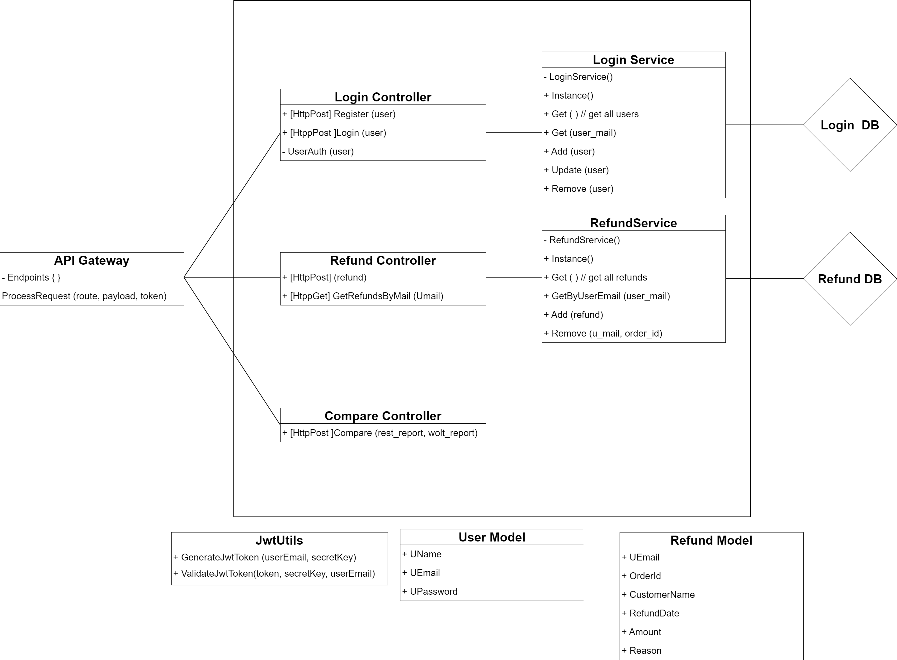

#                                   RefundApp
## An application designed to help restaurants manage their refunds and adjustments with delivery services.

### System Architecture - Overview:


### Development Setup
To enable HTTPS for development:
1. Run the following command in the project directory:
   ```bash
   openssl req -x509 -newkey rsa:2048 -keyout key.pem -out cert.pem -days 365 -nodes

1. Start the Flask app as usual. The app will automatically use cert.pem and key.pem.


